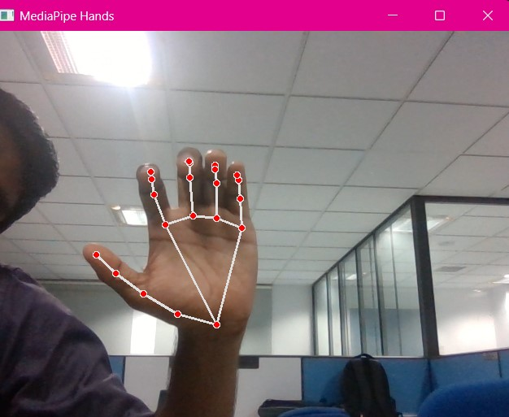
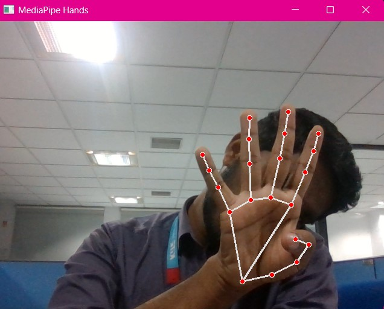
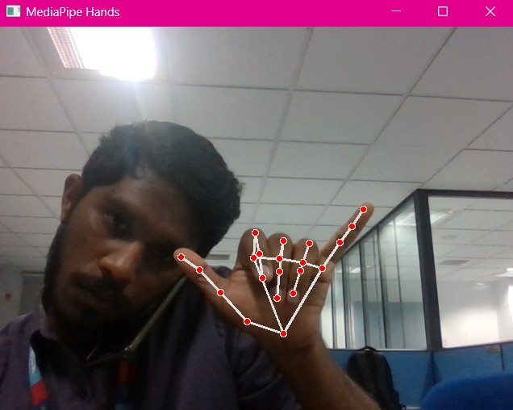
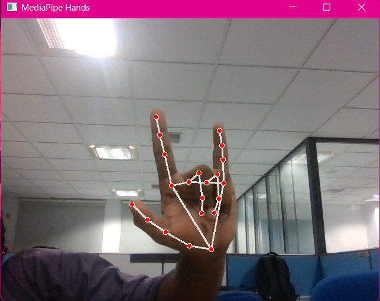
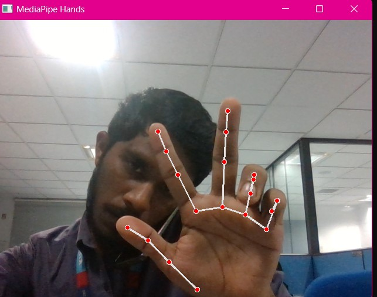
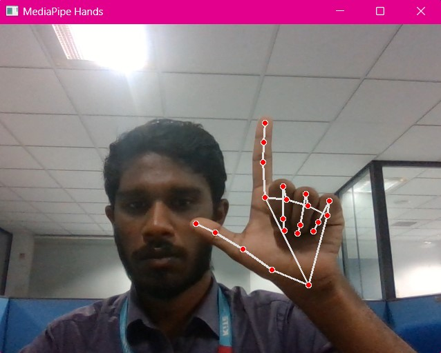

### GESTURE BASED YOUTUBE CONTROL

# Intro
Gesture-based interfaces are systems that allow users to interact with them by using hand or other body components. These applications are getting more and more popular and have a wide range of use cases; for example in home automation, healthcare, automative, virtual reality, etc. If well designed, gesture-based interfaces feel more natural, intuitive and easier to learn.

The goal of this project is to use simple python libraries to recognise a set of hand gestures and use those to interact with a YouTube player. Additionally, if the user is sleeping or has left, the player will get paused automatically. Here is a demo!!!

Why Youtube player, you might ask? Well, it's popular, there is no need to install a software locally, you can find pretty much any kind of visual content and it's free (as long as you're ok with advertisement 😉).
But of course, you can implement the same technique to control a local media player or anything else; just make sure the application allows for keyboard shortcuts or has an API.

---
# Installing the Requirements
* Install the following modules :
    pip install mediapipe
    pip install pyautogui
    pip install opencv-python

---
# To execute the project
* Run the following command :
    python gesture.py

---
# Guide for the Hand Gestures

The following are the gestures and their corresponding actions :

* The Five Finger gesture allows you to move to the next video on youtube
- 

* The Four Finger gesture allows you to play and pause the video
- 

* The Thumb and Little Finger gesture allows you to go back to the previous video if it exists
- 

* The Thumb, Index and Little Finger gesture allows you to skip the video 5s backwards
- 

* The Index, Middle and Thumb Finger gesture allows you to Mute and Unmute the video
- 

* The Index and Thumb Finger allows you to skip the video 5s forward
- 
